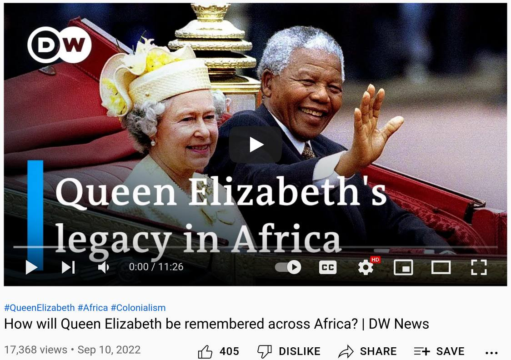
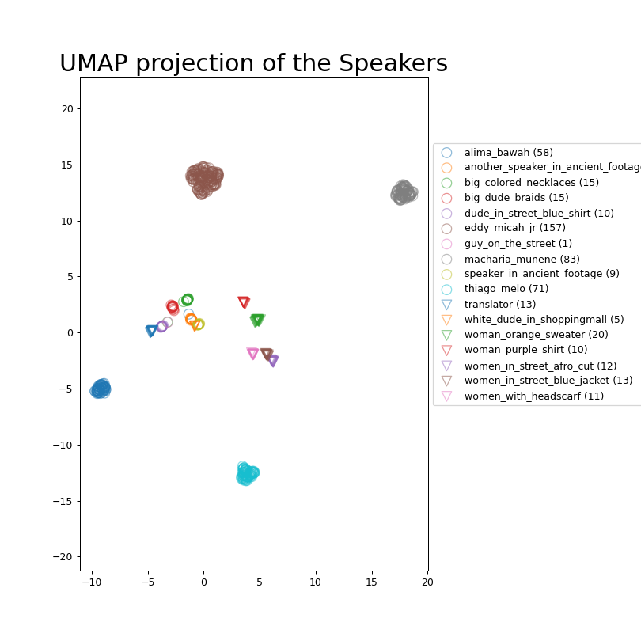
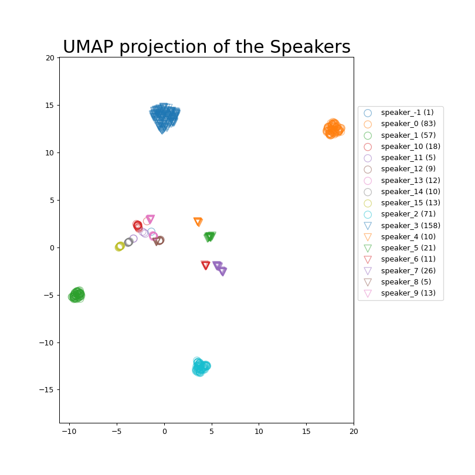

# speaker clustering
### https://www.youtube.com/watch?v=oLnl1D6owYA

### reference

### prediction

* scores look "nice", `SER` of 2% is good, `DER`/`miss_speaker` is quite high due to differences in segmentation
```commandline
 'oLnl1D6owYA': {'DER': 17.595888699173162,                                                                                                                                                                        
                 'SER': 2.0814825549038014,                                                                                                                                                                        
                 'fa_speaker': 0.38286173923818284,                                                                                                                                                                
                 'miss_speaker': 15.131544405031178,                                                                                                                                                               
                 'mutual_info_score': 0.9667955340252168,                                                                                                                                                          
                 'rand_score': 0.9852796977990118},
```
### diarization visualized
* first "row" is reference, second one prediction
* prediction has more finegrained segmentation -> this difference lead to high `miss_speaker` score, which only indicates that I was to lazy to manually label short audio segments -> the reference is not too accurate!
* at the very beginning if you "zoom in" you can actually see one of the rare "true" diarization erros (`SER`=="speaker_confusion")
  * there is a very short green segment where `big_colored_neglaces` speaks which got not recognized/clustered properly!
