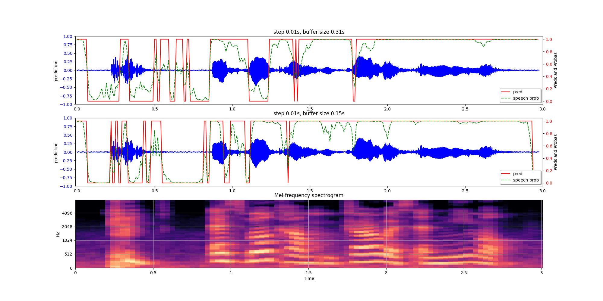

# Voice Activity Detection with Nvidia NeMo
* based on this [notebook](https://github.com/NVIDIA/NeMo/blob/v1.0.0/tutorials/asr/07_Online_Offline_Microphone_VAD_Demo.ipynb)
 
* nvividia says: `It is **not a recommended** way to do inference in production workflows. If you are interested in 
  production-level inference using NeMo ASR models, please sign-up to Jarvis early access program: https://developer.nvidia.com/nvidia-jarvis`

* setup
```shell
pip install -r requirements.txt
```
* [visualize_segmentation.py](scripts/visualize_segmentation.py)
