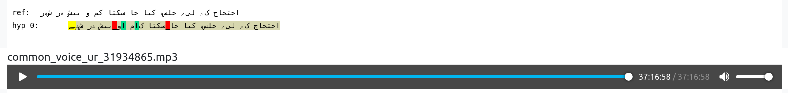

# evaluating some Urdu-ASR-models from huggingface-hub
## TL;DR
* this one looks good: https://huggingface.co/anuragshas/wav2vec2-xls-r-300m-ur-cv9-with-lm
* model was trained on `cv-corpus-9.0` but for fun I also evaluated it on `cv-corpus-11.0`

## evaluated on first 1k samples of common-voice test set

corpora \ service | anuragshas_wav2vec2-xls-r-300m-ur-cv9-with-lm-greedy
--- | ---                                       
cv-corpus-11.0-2022-09-21-ur-train-clean | 31.6%
cv-corpus-11.0-2022-09-21-ur-test-clean | 37.5%
cv-corpus-9.0-2022-04-27-ur-train-clean | 15.0%
cv-corpus-9.0-2022-04-27-ur-test-clean | 35.7%

## evaluated on first 1k samples of common-voice test set
### service - corpora, cased wer (same reference within rows&cols)                                                                                                                                                                                                              
service \ corpora | cv-corpus-11.0-2022-09-21-ur-test-clean                                                                                                                                                                                                                     
--- | ---                                                                                                                                                                                                                                                                       
Maniac_wav2vec2-xls-r-urdu-greedy | 66.0%                                                                                                                                                                                                                                       
Maniac_wav2vec2-xls-r-60-urdu-greedy | 79.0%                                                                                                                                                                                                                                    
kingabzpro_wav2vec2-urdu-greedy | 50.8%                                                                                                                                                                                                                                         
kingabzpro_wav2vec2-large-xls-r-300m-Urdu-greedy | 51.6%                                                                                                                                                                                                                        
kingabzpro_wav2vec2-60-urdu-greedy | 53.0%                                                                                                                                                                                                                                      
kingabzpro_wav2vec2-60-Urdu-V8-greedy | 50.7%                                                                                                                                                                                                                                   
anuragshas_wav2vec2-large-xls-r-300m-ur-cv8-greedy | 51.7%                                                                                                                                                                                                                      
anuragshas_wav2vec2-xls-r-300m-ur-cv9-with-lm-greedy | 34.4%

## common-voice urdu datasets
* version 9: `4.2`/`3.4` hours train/test, thats `3674` samples in train-set 
* version 11: `4.9`/`3.8` hours train/test

## looks like this
